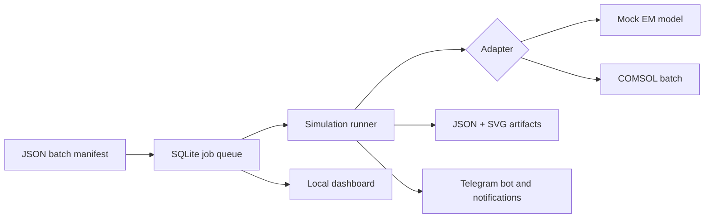

# Simulation Run Assistant

[](https://github.com/amkumirab/simulation-run-assistant/actions/workflows/tests.yml)
[](https://www.python.org/)
[](LICENSE)

A lightweight, zero-runtime-dependency control plane for reproducible simulation
sweeps. It queues parameter sets in SQLite, runs them through pluggable solver
adapters, stores result artifacts, exposes a live local dashboard, and can send
Telegram notifications.

> **Project status:** MVP / portfolio project. The included electromagnetic
> adapter is a deterministic demo model, not an engineering solver. The COMSOL
> integration is the next documented milestone.

## Why this project exists

Long simulation sweeps are easy to lose track of: inputs live in separate files,
failed runs are hard to retry, and progress is only visible on the machine doing
the work. Simulation Run Assistant puts a small, inspectable orchestration layer
around that workflow without requiring Redis, Docker, or a cloud account.

### Current features

- JSON manifests with explicit jobs or Cartesian parameter sweeps
- Persistent SQLite queue with atomic job claiming
- Failure isolation and explicit retry workflow
- Pluggable simulation adapter interface and official COMSOL batch bridge
- Deterministic electromagnetic mock adapter for demos and CI
- Per-job JSON results and dependency-free SVG response plots
- Auto-refreshing, read-only local web dashboard
- Authorized Telegram command bot and success/failure notifications
- Unit tests on Python 3.10 and 3.12 through GitHub Actions
- No third-party runtime dependencies

## Architecture



The adapter boundary keeps solver-specific behavior out of the orchestration
code. Adding COMSOL should not require changes to queueing, retries, reporting,
or the dashboard.

## Quick start

Requirements: Python 3.10 or newer.

```bash
python -m venv .venv
source .venv/bin/activate
python -m pip install -e .
sim-assistant init
sim-assistant enqueue examples/em_sweep.json
sim-assistant run
sim-assistant list
```

On Windows PowerShell, replace the `source` line with:

```powershell
.venv\Scripts\Activate.ps1
```

Each successful job creates:

```text
artifacts/
`-- job-000001/
    |-- result.json
    `-- response.svg
```

Open the live dashboard in a second terminal:

```bash
sim-assistant serve
```

Then visit [http://127.0.0.1:8080](http://127.0.0.1:8080). The page refreshes
every three seconds and the API is available at `/api/jobs`.

## Batch manifests

A compact sweep creates one job for every combination:

```json
{
  "name": "rectangular-waveguide-demo",
  "adapter": "mock-em",
  "fixed": {
    "width_mm": 20.0,
    "length_mm": 50.0,
    "relative_permittivity": 1.0
  },
  "sweep": {
    "frequency_ghz": [6.0, 8.0, 10.0, 12.0]
  }
}
```

For unrelated parameter sets, use an explicit `jobs` list instead. See
[`examples/explicit_jobs.json`](examples/explicit_jobs.json).

## CLI reference

```text
sim-assistant init                     Initialize the database
sim-assistant enqueue MANIFEST         Add a batch to the queue
sim-assistant run [--limit N]          Process queued jobs
sim-assistant list [--status STATUS]   List recent jobs
sim-assistant show JOB_ID              Print one complete job as JSON
sim-assistant retry JOB_ID             Requeue a failed job
sim-assistant serve [--port 8080]      Start the local dashboard
sim-assistant telegram-id              Discover recent Telegram chat IDs
sim-assistant bot                      Run the authorized Telegram command bot
sim-assistant comsol-check             Inspect COMSOL and MPH license requirements
```

Use `--database` and `--artifacts` before the subcommand to override runtime
locations:

```bash
sim-assistant --database data/runs.db --artifacts output run
```

## Telegram bot and notifications

Notifications are disabled by default. Set both environment variables before
running the worker:

```text
TELEGRAM_BOT_TOKEN=your_bot_token
TELEGRAM_CHAT_ID=your_chat_id
```

Copy `.env.example` as a reference, but do not commit credentials. Notification
errors are logged and never change a completed simulation into a failed job.

After configuring the authorized chat ID, start the interactive long-polling
bot with:

```bash
sim-assistant bot
```

It supports `/status`, `/jobs`, `/job`, `/run`, `/retry`, and `/help`. Commands
from chats other than `TELEGRAM_CHAT_ID` are ignored. See the complete
[Telegram setup guide](docs/TELEGRAM_BOT.md).

## Testing

The test suite only uses Python's standard library:

```bash
python -m unittest discover -s tests -v
```

## Adding another solver

Implement the small `SimulationAdapter` interface:

```python
from simulation_assistant.adapters.base import SimulationAdapter
from simulation_assistant.types import SimulationResult


class MySolverAdapter(SimulationAdapter):
    name = "my-solver"

    def run(self, parameters: dict, *, work_dir=None) -> SimulationResult:
        # Call the solver and normalize its output.
        return SimulationResult(metrics={}, series=[], metadata={})
```

Register the adapter in `SimulationRunner`, then use its name in a manifest.

## COMSOL batch integration

The `comsol` adapter copies the configured MPH model into a job-specific
artifact directory, applies manifest parameters through COMSOL's `-pname` and
`-plist` batch options, runs one study or job sequence, stores `output.mph` and
`comsol.log`, and extracts saved numerical tables into `result.json`.

Configure `COMSOL_EXECUTABLE`, `COMSOL_MODEL_PATH`, and optionally
`COMSOL_STUDY_TAG`, then validate the setup:

```bash
sim-assistant comsol-check
```

See [`docs/COMSOL_INTEGRATION.md`](docs/COMSOL_INTEGRATION.md) for the full
configuration and model contract.

## Roadmap

The repository intentionally leaves useful, portfolio-worthy increments for
future commits:

- COMSOL result-export contracts for additional model families
- Attach result plots to Telegram messages
- Parallel workers with configurable license-seat limits
- Stop/cancel controls and stale-running-job recovery
- Batch comparison reports and convergence diagnostics
- Authentication before any non-local deployment
- Container image and scheduled worker mode

## Project structure

```text
src/simulation_assistant/
|-- adapters/       # Solver boundary, mock model, COMSOL batch adapter
|-- cli.py          # Command-line interface
|-- manifest.py     # JSON validation and sweep expansion
|-- notifications.py
|-- telegram_api.py # Minimal Telegram Bot API client
|-- telegram_bot.py # Authorized long-polling command bot
|-- reporting.py    # JSON and SVG artifacts
|-- runner.py       # Failure-isolated worker loop
|-- storage.py      # SQLite queue and state transitions
`-- web.py          # Dependency-free dashboard and JSON API
```

## Limitations

- The worker is foreground-only and processes one job at a time.
- The dashboard is read-only and intended for localhost use.
- Secrets are read from the process environment; `.env` files are not loaded
  automatically.
- The Telegram command bot is a foreground long-polling process.
- COMSOL requires a local installation, compatible licenses, and a known model
  contract; arbitrary MPH files cannot be interpreted automatically.

## License

[MIT](LICENSE)

## Contributing and security

Contributions are welcome. Read [CONTRIBUTING.md](CONTRIBUTING.md) before
opening a pull request. Please report security issues according to
[SECURITY.md](SECURITY.md), not in a public issue.
