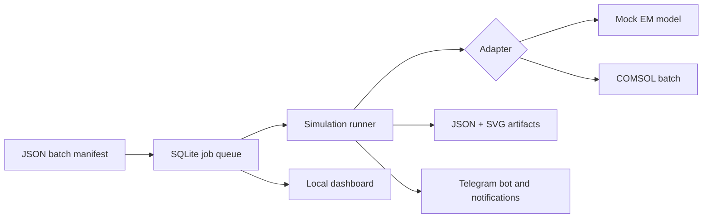

# Simulation Run Assistant

[](https://github.com/amkumirab/simulation-run-assistant/actions/workflows/tests.yml)
[](https://www.python.org/)
[](LICENSE)

A lightweight, zero-runtime-dependency control plane for reproducible simulation
sweeps. It queues parameter sets in SQLite, runs them through pluggable solver
adapters, stores result artifacts, exposes a live local dashboard, and can send
Telegram notifications.

> **Project status:** MVP / portfolio project. The included electromagnetic
> adapter is a deterministic demo model, not an engineering solver. The COMSOL
> adapter requires a local installation and compatible licenses.

## Why this project exists

Long simulation sweeps are easy to lose track of: inputs live in separate files,
failed runs are hard to retry, and progress is only visible on the machine doing
the work. Simulation Run Assistant puts a small, inspectable orchestration layer
around that workflow without requiring Redis, Docker, or a cloud account.

### Current features

- JSON manifests with explicit jobs or Cartesian parameter sweeps
- Persistent SQLite queue with atomic claiming, pause/resume controls, and recovery
- Failure isolation, reversible cancellation, active-run stopping, and retries
- Pluggable simulation adapter interface and official COMSOL batch bridge
- Deterministic electromagnetic mock adapter for demos and CI
- Per-job JSON results and dependency-free SVG response plots
- Guided local web assistant for COMSOL connection checks, run setup, queueing,
  targeted execution, monitoring, details, and retries
- Native desktop assistant with no browser or local web server requirement
- Live COMSOL stage, percentage, elapsed time, activity warning, and log monitoring
- Local workspace profiles for recent models, COMSOL targets, formulas, and sweep presets
- COMSOL Plot Group discovery, viewing, sweep comparison, and portable reports
- Native parameter-sweep builder with Cartesian preview, sequential execution,
  and runtime estimates based on recent COMSOL runs
- Duplicate-run preflight with reusable-result detection and new-job-only estimates
- Safe custom output formulas and comparison across successful simulation states
- Batch-filtered comparison charts, highest-value highlighting, and CSV export
- Constrained sweep ranking with maximize/minimize objectives and CSV export
- Unit-aware parameter comparison with SI normalization and dimension checks
- Versioned COMSOL model contracts with pre-run compatibility and limit checks
- COMSOL result-pipeline inspection with freshness states and corrective guidance
- Authorized Telegram command bot and success/failure notifications
- Unit tests on Python 3.10 and 3.12 through GitHub Actions
- No third-party runtime dependencies

## Architecture



The adapter boundary keeps solver-specific behavior out of the orchestration
code. Adding another solver does not require changes to queueing, retries,
reporting, or the dashboard.

## Quick start

Requirements: Python 3.10 or newer.

```bash
python -m venv .venv
source .venv/bin/activate
python -m pip install -e .
sim-assistant init
sim-assistant enqueue examples/em_sweep.json
sim-assistant run
sim-assistant list
```

On Windows PowerShell, replace the `source` line with:

```powershell
.venv\Scripts\Activate.ps1
```

Each successful job creates:

```text
artifacts/
`-- job-000001/
    |-- result.json
    `-- response.svg
```

Open the live dashboard in a second terminal:

```bash
sim-assistant serve
```

Then visit [http://127.0.0.1:8080](http://127.0.0.1:8080). The guided workflow
detects the COMSOL executable, checks an MPH model and its licenses, imports
model parameters, and lets you queue or start a run. Model paths remain in the
current browser session and are not saved by the dashboard.

### Native desktop mode

On a workstation with Tkinter available (included with standard Windows Python),
start the native application instead of the web dashboard:

```powershell
sim-assistant desktop
```

The desktop workspace provides native file pickers, COMSOL validation, editable
model inputs, computed-output formulas, Run now and Queue only actions, run
details, local artifact access, and visual comparison for repeated simulation
states. It does not start an HTTP server or require a browser.

After **Check connection**, the workspace reports whether the selected target's
result pipeline is **Fresh**, **Stale**, **Incomplete**, or **Unknown**. Choose
**View pipeline** to inspect the exact Study, Dataset, Derived Values, and Table
links, along with the expressions, units, Job Sequence steps, and recommended
corrections. See [`docs/RESULT_PIPELINE.md`](docs/RESULT_PIPELINE.md).

The **Runs** tab also provides persistent **Pause queue**, **Cancel selected**,
**Stop selected**, and **Recover interrupted** controls. Pausing prevents the next
job from starting, while Stop selected targets the active solver process and keeps
the cancelled run in history. Recovery is always explicit so an active worker in
another terminal is not mistaken for an interrupted run.
See [`docs/QUEUE_CONTROL.md`](docs/QUEUE_CONTROL.md) for the safe workflow.

While a COMSOL job is running, the queue displays the latest percentage and
solver stage parsed from `comsol.log`. Double-click the row to open **Live
monitor**, which refreshes the elapsed time, last activity, recent log output,
and stop control without blocking the desktop interface. A warning appears after
five minutes without new log output; this is a diagnostic signal, not an
automatic failure. See [`docs/LIVE_RUN_MONITOR.md`](docs/LIVE_RUN_MONITOR.md).

Choose **Review plan** before starting or queueing a sweep to detect states that
already succeeded, are already scheduled, or repeat inside the current request.
The same preflight runs automatically during submission. You can skip duplicates
and reuse existing results, run every state again, or return to the workspace.
See [`docs/RUN_PREFLIGHT.md`](docs/RUN_PREFLIGHT.md) for identity and privacy
details.

Use the **Workspace profile** controls to save a repeatable local setup. A profile
remembers the COMSOL executable, MPH model, Study or Job Sequence, timeout, core
count, run label, raw parameter values, Fixed/Sweep modes, and computed-output
formulas. Profiles are ordered by recent use and the last saved profile is
restored when the desktop app starts. Select **Duplicate** to create a variant or
**Delete** to remove only the local profile without affecting simulation results.
After a connection check, the workspace also lists the model's saved 1D, 2D,
and 3D Plot Groups. Select up to 12 plot tags to preserve the intended visual
outputs in the profile. Each selected plot is exported as a PNG after a
successful solve and stored in that job's `plots` artifact directory. Export
status and individual plot errors appear in the native job-details window.
Double-click a completed queue row and open **Results** to browse the images,
move between Plot Groups, inspect dimensions and file sizes, or open the original
PNG in the system image viewer. No browser or local server is involved.
Use **Compare runs** for any preview to place the same Plot Group from successful
jobs in that batch side by side. Each comparison card shows its job number,
parameter state, image size, and original PNG action, while the selected job is
clearly marked.
Choose **Export report** from the comparison gallery to create one portable HTML
file containing every displayed PNG and its full parameter table. The report is
responsive, printable, and can be opened or shared without the database,
artifact folders, a local server, or an internet connection.

Profiles are stored in `.sim-assistant/profiles.json`, which is excluded by the
repository's `.gitignore`. **Export template** creates a shareable JSON template
that deliberately excludes both the COMSOL executable path and MPH model path.
Review parameter and formula names before publishing an exported template if the
model contract itself is confidential.

For a parameter sweep, change one or more input rows from **Fixed** to **Sweep**.
Enter either an explicit comma-separated list or an inclusive numeric range:

```text
70[kHz], 80[kHz], 90[kHz]
70:100:10[kHz]
```

The workspace previews the Cartesian job count and estimates the sequential
runtime from recent successful COMSOL runs. Sweep jobs run one at a time to
respect the default local license-seat workflow. The **Compare runs** tab can
filter one batch, plot a numeric input against an output metric, identify the
highest result, and export the visible rows as CSV.

Use **Rank results** after a sweep to select a numeric output or computed formula
as the objective, choose **Maximize** or **Minimize**, and add optional limits on
model inputs or result outputs. Runs with missing values are reported separately
from runs rejected by a constraint. The best feasible run is highlighted;
double-click any ranked row to open its complete job details. Ranking CSV files
contain the objective, evaluated constraint values, and input state without local
artifact paths. See [`docs/RESULT_RANKING.md`](docs/RESULT_RANKING.md).

Dimensional parameter values are normalized before charting or constraint
evaluation, so `0.15[m]`, `15[cm]`, and `150[mm]` compare as the same length.
Unknown units, non-finite values, and incompatible physical dimensions are not
silently reduced to their leading number. See
[`docs/QUANTITIES.md`](docs/QUANTITIES.md) for supported units and safety rules.

Computed outputs are safe arithmetic expressions over normalized numeric result
metrics. For example:

```text
solve_time_ratio = comsol_duration_seconds / comsol_reported_total_seconds
coupling = mutual_inductance / sqrt(primary_inductance * secondary_inductance)
```

Physical output symbols from COMSOL tables are fresh only when a COMSOL job
sequence reevaluates Derived Values after solving. Study-only runs deliberately
exclude saved tables from fresh metrics.

## Batch manifests

A compact sweep creates one job for every combination:

```json
{
  "name": "rectangular-waveguide-demo",
  "adapter": "mock-em",
  "fixed": {
    "width_mm": 20.0,
    "length_mm": 50.0,
    "relative_permittivity": 1.0
  },
  "sweep": {
    "frequency_ghz": [6.0, 8.0, 10.0, 12.0]
  }
}
```

For unrelated parameter sets, use an explicit `jobs` list instead. See
[`examples/explicit_jobs.json`](examples/explicit_jobs.json).

## CLI reference

```text
sim-assistant init                     Initialize the database
sim-assistant enqueue MANIFEST         Add a batch to the queue
sim-assistant run [--limit N]          Process queued jobs
sim-assistant list [--status STATUS]   List recent jobs
sim-assistant show JOB_ID              Print one complete job as JSON
sim-assistant retry JOB_ID             Requeue a failed or cancelled job
sim-assistant cancel JOB_ID            Cancel one queued job
sim-assistant stop JOB_ID              Request a stop for one running job
sim-assistant pause                    Pause new queue claims
sim-assistant resume                   Resume queue processing
sim-assistant recover [--fail]         Resolve interrupted running jobs
sim-assistant serve [--port 8080]      Start the local dashboard
sim-assistant desktop                  Start the native desktop assistant
sim-assistant telegram-id              Discover recent Telegram chat IDs
sim-assistant bot                      Run the authorized Telegram command bot
sim-assistant comsol-check             Inspect COMSOL and MPH license requirements
```

Use `--database` and `--artifacts` before the subcommand to override runtime
locations:

```bash
sim-assistant --database data/runs.db --artifacts output run
```

## Telegram bot and notifications

Notifications are disabled by default. Set both environment variables before
running the worker:

```text
TELEGRAM_BOT_TOKEN=your_bot_token
TELEGRAM_CHAT_ID=your_chat_id
```

Copy `.env.example` as a reference, but do not commit credentials. Notification
errors are logged and never change a completed simulation into a failed job.

After configuring the authorized chat ID, start the interactive long-polling
bot with:

```bash
sim-assistant bot
```

It supports `/status`, `/jobs`, `/job`, `/run`, `/retry`, `/cancel`, `/stop`,
`/pause`, `/resume`, and `/help`. Commands
from chats other than `TELEGRAM_CHAT_ID` are ignored. See the complete
[Telegram setup guide](docs/TELEGRAM_BOT.md).

## Testing

The test suite only uses Python's standard library:

```bash
python -m unittest discover -s tests -v
```

## Adding another solver

Implement the small `SimulationAdapter` interface:

```python
from simulation_assistant.adapters.base import SimulationAdapter, SimulationCancelled
from simulation_assistant.types import SimulationResult


class MySolverAdapter(SimulationAdapter):
    name = "my-solver"

    def run(
        self,
        parameters: dict,
        *,
        work_dir=None,
        cancel_requested=None,
    ) -> SimulationResult:
        if cancel_requested and cancel_requested():
            raise SimulationCancelled("Stop requested by user")
        # Call the solver and normalize its output.
        return SimulationResult(metrics={}, series=[], metadata={})
```

Register the adapter in `SimulationRunner`, then use its name in a manifest.

## COMSOL batch integration

The `comsol` adapter copies the configured MPH model into a job-specific
artifact directory, applies manifest parameters through COMSOL's `-pname` and
`-plist` batch options, runs one study or job sequence, stores `output.mph` and
`comsol.log`, and extracts saved numerical tables into `result.json`.

Configure `COMSOL_EXECUTABLE`, `COMSOL_MODEL_PATH`, and optionally
`COMSOL_STUDY_TAG` and `COMSOL_CONTRACT_PATH`, then validate the setup:

```bash
sim-assistant comsol-check
```

See [`docs/COMSOL_INTEGRATION.md`](docs/COMSOL_INTEGRATION.md) for the full
configuration. See [`docs/MODEL_CONTRACT.md`](docs/MODEL_CONTRACT.md) for the
versioned contract schema, desktop preflight states, and WPT example.

## Scientific roadmap

Versioned WPT model contracts now define visible design inputs, protected
internal parameters, required outputs, units, table bindings, and safe limits.
COMSOL result-pipeline inspection now verifies the links between Study, Dataset,
Derived Values, Table, and Job Sequence steps before treating outputs as fresh.
Future increments prioritize trustworthy WPT results before expanding secondary
interfaces or deployment options:

1. Add a scientific validation gate for required metrics, reciprocity,
   physical bounds, mesh quality, and solver warnings.
2. Add an explicit storage-retention policy before running large production
   sweeps with copied MPH files.
3. Run and document the baseline 36-state gap, offset, and tilt sweep with the
   production IBC model.
4. Add Pareto-front analysis for coupling, resistance, and leakage trade-offs.
5. Add robust grouped objectives across misalignment states.
6. Validate selected designs against a higher-fidelity volume reference model.

Production and reference MPH files remain local and are never committed to this
repository.

## Project structure

```text
src/simulation_assistant/
|-- adapters/       # Solver boundary, mock model, COMSOL batch adapter
|-- cli.py          # Command-line interface
|-- desktop.py      # Native Tkinter assistant
|-- formulas.py     # Safe computed-output expression engine
|-- model_contract.py # Versioned model interface and compatibility checks
|-- manifest.py     # JSON validation and sweep expansion
|-- notifications.py
|-- plot_artifacts.py # Safe plot lookup and native preview helpers
|-- profiles.py     # Local workspace profiles and sanitized template export
|-- quantities.py   # Unit parsing, dimensions, and SI normalization
|-- ranking.py      # Constrained objective ranking and CSV export
|-- result_pipeline.py # COMSOL output lineage and freshness inspection
|-- telegram_api.py # Minimal Telegram Bot API client
|-- telegram_bot.py # Authorized long-polling command bot
|-- reporting.py    # JSON and SVG artifacts
|-- runner.py       # Failure-isolated worker loop
|-- storage.py      # SQLite queue and state transitions
|-- sweeps.py       # Native sweep parsing, estimates, and CSV comparison export
`-- web.py          # Dependency-free dashboard and JSON API
```

## Limitations

- The worker is foreground-only and processes one job at a time.
- The native interface runs COMSOL work in background threads but processes
  queue jobs sequentially to respect local license-seat constraints.
- The interactive dashboard only binds to a loopback address. Its write API is
  protected by a random in-memory token generated for each server session.
- Secrets are read from the process environment; `.env` files are not loaded
  automatically.
- Native workspace profiles are local to the current project directory and are
  not synchronized between machines automatically.
- The Telegram command bot is a foreground long-polling process.
- COMSOL requires a local installation, compatible licenses, and a known model
  contract; arbitrary MPH files cannot be interpreted automatically.

## License

[MIT](LICENSE)

## Contributing and security

Contributions are welcome. Read [CONTRIBUTING.md](CONTRIBUTING.md) before
opening a pull request. Please report security issues according to
[SECURITY.md](SECURITY.md), not in a public issue.
