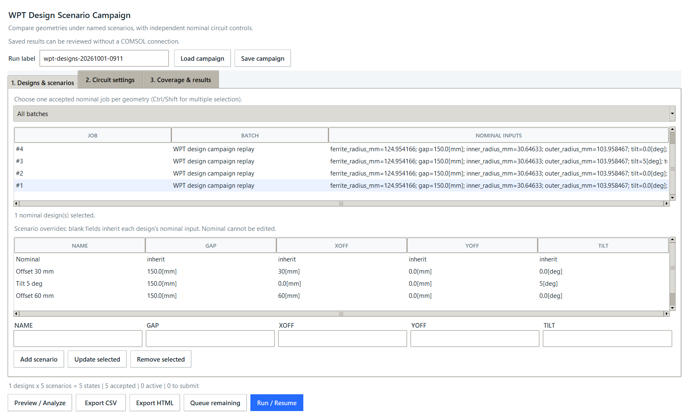
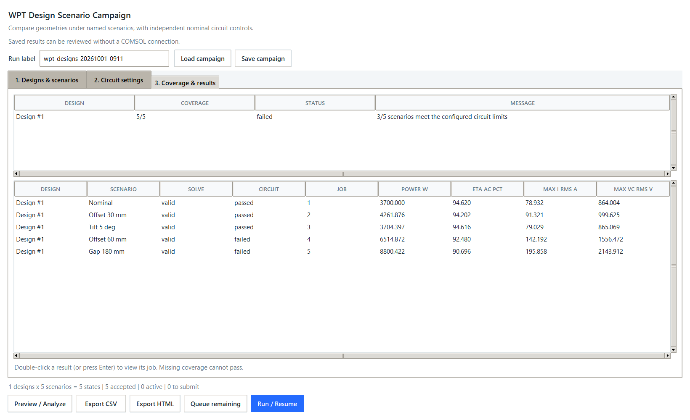

# Design Scenario Campaigns

## Objective and contract

Evaluate several WPT geometries under the same named operating scenarios before
choosing a design. Each selected job supplies one design's nominal inputs. The
first scenario is Nominal and inherits those inputs unchanged. Additional rows
override only `gap`, `xoff`, `yoff`, and `tilt`; they never change geometry.

Success means one independently traceable state per design and scenario, reusable
accepted results, no duplicate active solves, and separate nominal Series-Series
controls for each design. Incomplete coverage must never be reported as passed.
Runtime dependencies remain Python's standard library and Tkinter.

## Desktop workflow

1. Open the native app with `sim-assistant desktop`. Go to **Runs** and select
   **Design scenarios**. No browser or local web server is needed.
2. In **Designs & scenarios**, filter by batch and Ctrl/Shift-select one accepted
   nominal job per geometry. Use the nominal IDs from your ranking or Pareto
   shortlist. Inputs come from those saved jobs, not the current sweep editor.
   Selecting two operating points of the same geometry is an error.
3. Keep the Nominal row unchanged. Use the fields and **Add scenario** to define
   additional named cases. Enter units, for example `30[mm]` and `5[deg]`.
   Blank fields inherit each design's nominal value. Select a non-Nominal row
   to update or remove it. The default list is a starting point, not a universal
   qualification standard. Models without these input names cannot use it.
4. In **Circuit settings**, map the nine two-port metrics to SI outputs. Review
   target AC load power, capacitor ESR, load search range and electrical limits.
   Each design is tuned separately; compensation, source, load and frequency
   then stay fixed across that design's scenarios.
5. Click **Preview / Analyze**. For example, 3 geometries and 5 scenario rows mean
   15 states, not a Cartesian cross-product of the scenario columns. Accepted
   results and queued/running jobs are counted separately. Time/storage estimates
   use recent run evidence when available and are approximate.
6. Before executing, connect the original model in the main app, select its
   contract and Job Sequence, and run **Check connection**. The contract must be
   accepted and the result pipeline Fresh. The model, target, plot selection,
   contract and custom-formula identity must match the source campaign exactly.
   A modified model or contract requires a new campaign and new nominal evidence.
7. Use **Queue remaining** to schedule missing, failed, cancelled, rejected or
   unvalidated states. Use **Run / Resume** to process those states plus matching
   queued states sequentially. Accepted or running states are not submitted again.
   Use the main Runs queue to pause/resume or recover genuinely interrupted jobs.
8. Use **Save campaign** before closing the dialog. After restarting, use
   **Load campaign**, reconnect the matching model, and preview again. Configuration
   retains inputs, identity, mapping and limits, while coverage is always rebuilt
   from the current SQLite database. Save again after changing scenario rows or
   settings; dialog edits are not autosaved.
9. Export **CSV** or **HTML** for a portable report. CSV has SI values, signatures,
   inputs, individual checks and fixed controls; text cells are guarded against
   spreadsheet-formula execution. HTML includes a readable table and expandable
   complete per-scenario evidence, without local model/artifact paths.



Exact run signatures intentionally distinguish input expressions such as
`150[mm]` and `15[cm]`: physical equivalence is checked when rejecting duplicate
scenario rows/designs, but does not silently alter existing simulation identities.
Select the original nominal values and preserve scenario spelling to reuse
existing results. Candidate selection displays up to 5,000 recent successful jobs.
Offline analysis does not require COMSOL; new solves do require its local license.

## Coverage and electrical status

| Status | Meaning |
| --- | --- |
| `incomplete` | At least one required scenario lacks an available accepted result. |
| `ineligible` | Coverage is complete, but the nominal or a scenario cannot be evaluated from the mapped two-port data. |
| `failed` | Coverage is complete and at least one circuit limit fails. |
| `passed` | Every required scenario is accepted, evaluable and passes the configured electrical limits. |

Solver completion and electrical feasibility are different. A scientifically
accepted FEM result can still exceed coil-current or capacitor-voltage limits.
Review individual rows even when the design remains incomplete. Warnings remain
visible and follow the existing accepted-result policy.

## Replay the stored real WPT example

```powershell
.\.venv\Scripts\python.exe examples\replay_design_campaign.py --desktop
```

This uses the existing published dataset in an isolated workspace at
`.sim-assistant/design-example`. It does not call COMSOL or alter your production
database. The workspace contains `jobs.db`, `design-campaign.json`, and CSV/HTML
reports. Repeating the command reuses the imported states instead of duplicating
them. The replay identity is intentionally not executable as a live model.

Expected result: 5/5 accepted states; Nominal, Offset 30 mm and Tilt 5 deg pass;
Offset 60 mm and Gap 180 mm fail. The overall design is **failed**, not robustly
feasible. The screenshots are actual native UI captures from this replay.



These are completed three-dimensional COMSOL outputs, not new solves, fabricated
results or hardware measurements. AC resonant-stage efficiency is not end-to-end
charger efficiency. Material models, component ESR and electrical limits remain
provisional; these reports do not demonstrate thermal or hardware qualification.

## Architecture and boundaries

- `design_campaigns.py`: scenario expansion, signatures, coverage and circuit grouping.
- `design_campaign_reports.py`: portable configuration and CSV/HTML evidence.
- `design_campaign_ui.py`: native campaign editor and existing sequential runner integration.
- `tests/test_design_campaigns.py`: behavioral and real stored-result regression tests.

Reuse the canonical campaign classifier and circuit solver. Do not change the
database schema, existing run signatures, COMSOL model, or public baseline preset.
New execution requires an accepted model contract, a Fresh Job Sequence, and the
same model/contract/formula identity as the saved campaign. Always validate inputs
and escape report text; never publish local paths, credentials, or private models.
Ask before introducing dependencies or changing scientific qualification rules.

```python
plan = build_design_campaign(
    designs, scenarios, output_formulas=formulas,
    run_context=context, existing_jobs=jobs,
)
```

## Verification commands

```powershell
.\.venv\Scripts\python.exe -m unittest discover -s tests -p test_design_campaigns.py -v
.\.venv\Scripts\python.exe -m unittest discover -s tests
.\.venv\Scripts\python.exe examples\check_design_campaign_ui.py
.\.venv\Scripts\python.exe -m pip wheel . --no-deps --wheel-dir .sim-assistant/build-check
```

## Acceptance criteria

- Multiple accepted nominal jobs expand into explicit named scenarios, not a Cartesian sweep.
- Reject ambiguous duplicate designs, equivalent scenario states, unsupported units,
  non-finite values, and more than 500 design/scenario pairs.
- Valid/warning states are reused by exact run signature; active states are not resubmitted.
  Failed, cancelled, rejected and unvalidated states remain retryable.
- Each geometry is tuned from its own accepted nominal result. Reports include
  coverage, per-scenario checks, fixed controls, limits and missing-result reasons.
- Configuration survives restart; database results are queried again, never trusted
  from a stale report. A different connected model cannot execute the saved plan.
- Desktop empty/error/success states, keyboard operation and narrow-window layout
  are checked. Tests replay the published stored WPT data without claiming a new solve.
