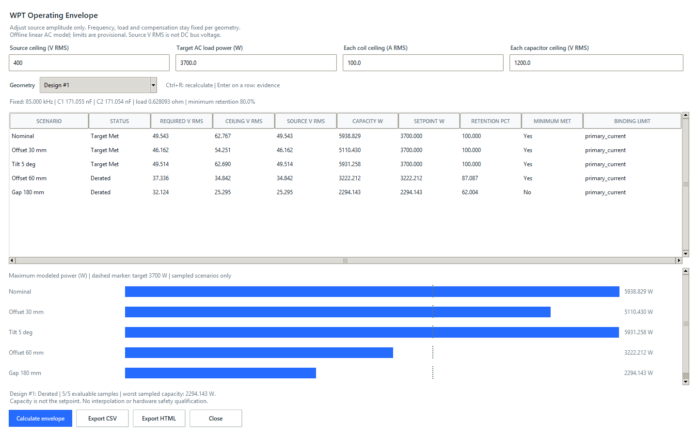
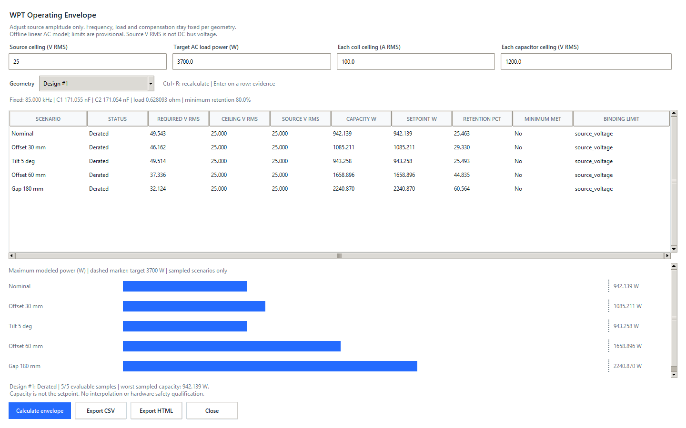

# WPT operating envelopes and power derating

## Objective and scope

Extend a Design Scenario Campaign with source-amplitude-only control. Tune each
geometry at its own accepted nominal state, then hold frequency, load, C1, C2 and
capacitor ESR fixed across its named scenarios. Compute the source voltage needed
for the target AC load power and the maximum modeled power under user-supplied
source, coil-current and capacitor-voltage RMS limits.

This is offline postprocessing of accepted, passive two-port FEM results. It does
not change an MPH file, enqueue solves, control hardware, or certify electrical
or thermal safety. The linear, sinusoidal equivalent assumes amplitude-independent
inductance and resistance. Source voltage means the fundamental AC RMS voltage,
not DC bus voltage. Pure amplitude adjustment does not improve AC efficiency.

## Calculation contract

At one volt RMS, calculate each scenario with the nominal fixed circuit controls.
Currents and voltages scale with source amplitude; powers scale with its square.
The five source ceilings are the configured source voltage, primary and secondary
current limits divided by their one-volt currents, and primary and secondary
capacitor limits divided by their one-volt voltages. Their minimum sets the
maximum voltage and power. Report all tied limiting constraints.

Required source = sqrt(target power / one-volt load power). The recommended
modeled operating point uses the smaller of required and maximum source voltage.
Re-solve that point and the ceiling to verify finite output and energy balance.
No positive transfer, failed validation, frequency mismatch, missing nominal or
scenario evidence, and non-passive data produce explicit unavailable results.
Do not silently omit unavailable rows or claim a complete envelope.

Rebuild campaign coverage from current jobs before analysis; match adapter,
parameters, model/formula identity and recomputed run signatures. Never rely on
cached operating points after job status or acceptance changes.

## Architecture and implementation plan

- `operating_envelopes.py`: immutable limit/result contracts and pure analysis.
- `envelope_reports.py`: path-free CSV and self-contained HTML evidence/plots.
- `envelope_ui.py`: native Tk dialog opened from Design scenarios; no new dependency.
- `tests/test_operating_envelopes.py`: mathematical, eligibility and report tests.
- `examples/replay_operating_envelope.py`: isolated stored COMSOL replay.

Build in order: tested numerical analysis, tested portable reports, native
workflow, reproducible example and documentation. Existing campaign files and
queue behavior remain compatible; no database schema change is required.

## Acceptance criteria and verification

- Target-met, derated and unavailable states are distinguishable in every view.
- Source, both coil currents and both capacitor voltages bound the calculation.
- Missing coverage cannot yield a worst-case power claim or a complete status.
- Each geometry retains its own nominal compensation and load.
- Tables and categorical charts label W, V RMS and A RMS explicitly, with no
  interpolation or extrapolation between scenario samples.
- Reports include job IDs, signatures, validation, inputs, two-port metrics,
  controls, configured limits, ceilings and operating-point checks.
- Invalid user inputs clear stale results; exports re-analyze current settings.
- Real stored-result replay, native UI verification and complete tests pass.

Commands (PowerShell, repository root):

```powershell
.\.venv\Scripts\python.exe -m unittest discover -s tests -p test_operating_envelopes.py
.\.venv\Scripts\python.exe -m unittest discover -s tests
.\.venv\Scripts\python.exe examples/check_operating_envelope_ui.py
.\.venv\Scripts\python.exe examples/replay_operating_envelope.py --desktop
.\.venv\Scripts\python.exe -m pip wheel . --no-deps --wheel-dir .sim-assistant/build-check
```

Style: frozen dataclasses, snake_case, standard library only, ValueError for
invalid configuration and explicit unavailable rows for invalid scenario data.
Always preserve original FEM evidence. Never publish private model paths or
secrets, modify production models, or describe replayed data as a new solve or
hardware measurement.

## Desktop walkthrough

1. Start the native app with `sim-assistant desktop`.
2. Open **Runs > Design scenarios**, select accepted nominal geometry jobs, and
   configure the named scenarios and SI two-port mapping. A saved campaign may
   also be loaded. A COMSOL connection is not needed for offline review.
3. Click **Power envelope**. Each geometry is tuned independently from its current
   accepted nominal job. Select a geometry to inspect its sampled envelope.
4. Enter the source ceiling (fundamental AC V RMS), target AC load power (W),
   per-coil current ceiling (A RMS), and per-capacitor voltage ceiling (V RMS).
   The initial 400 V RMS source ceiling is an illustrative placeholder, not a
   recommended hardware rating. Replace all provisional limits with project values.
5. Click **Calculate envelope**, or press Ctrl+R. Changing a field clears the old
   view so that it cannot be mistaken for a result under the new settings.
6. Inspect the capacity, setpoint, retention and binding limit. **Target Met**
   means the modeled target is reachable under these electrical limits.
   **Derated** means the recommended modeled setpoint is below target.
   **Unavailable** means the evidence cannot support a calculation.
7. **Minimum met** refers to the campaign's minimum target-power retention
   (80% by default), not to hardware safety. A derated state can meet this minimum
   while still missing the full target. Adjust retention and energy tolerance in
   the campaign's Circuit settings before opening the envelope.
8. Press Enter or double-click a row to inspect its job/signature, two-port data,
   component ceilings, operating point and stress checks.
9. Export CSV or HTML. Exports recheck current jobs and settings and include all
   designs, not just the selected view. HTML opens locally without a server.

The chart is categorical: bars show maximum modeled capacity at the sampled
scenarios; dashed markers show target power. The setpoint never exceeds the
target. Missing samples leave the overall design incomplete and its worst-case
capacity unavailable. No safe continuous gap/offset/tilt range is inferred.

## Reproduce the stored COMSOL example

```powershell
.\.venv\Scripts\python.exe examples/replay_operating_envelope.py --desktop
```

This imports the five published **3D** COMSOL cases into an isolated database in
`.sim-assistant/envelope-example`. It does not solve a new model, modify the
original 2D charger, or use the production job queue. The underlying dataset is
`examples/wpt_circuit_results.json`, with recorded source qualification checks and
SHA-256 identities. Replay uses those qualified outputs; it is not an independent
revalidation of the original FEM files or a hardware measurement.

At 3,700 W target, 400 V RMS source ceiling, 100 A RMS per coil, 1,200 V RMS per
capacitor and 80% minimum target retention:

| Sample | Target status | Maximum modeled power (W) | Setpoint (W) | Minimum retention met |
|---|---|---:|---:|---|
| Nominal | Target Met | 5,938.829 | 3,700.000 | Yes |
| Offset 30 mm | Target Met | 5,110.430 | 3,700.000 | Yes |
| Tilt 5 deg | Target Met | 5,931.258 | 3,700.000 | Yes |
| Offset 60 mm | Derated | 3,222.212 | 3,222.212 | Yes |
| Gap 180 mm | Derated | 2,294.143 | 2,294.143 | No |

Primary coil current binds all five capacity calculations at these limits. The
worst sampled capacity is 2,294.143 W. These are predictions of the linear circuit
equivalent, not measurements or ratings. Derating changes source amplitude but
does not retune compensation or increase the modeled AC efficiency.



Reducing the source ceiling to 25 V RMS makes source voltage bind every sample.
The other limits and geometry remain unchanged:



Both images are genuine captures of the native application running the stored
data replay. Pillow is needed only for the optional development screenshot flag;
it is not an application dependency.

Portable examples: [HTML report](examples/wpt-operating-envelope.html) and
[CSV evidence](examples/wpt-operating-envelope.csv). To regenerate them:

```powershell
.\.venv\Scripts\python.exe examples/replay_operating_envelope.py --report-dir docs/examples
```

## Numerical and evidence boundaries

Stress comparisons permit 1e-10 relative tolerance to accommodate floating-point
roundoff, not an engineering margin. Energy-balance tolerance remains the explicit
campaign value. Unsupported numerical ranges produce unavailable states instead
of infinite capacities. Component ceilings are computed for both coils and both
capacitors, even when only one binds. All tied constraints are recorded.

Reports carry the actual nominal job ID and nominal source amplitude separately
from fixed circuit controls. Local model paths and model contents are not exported.
Text is HTML-escaped; spreadsheet formula prefixes are neutralized in CSV text cells.
There are no external report assets, scripts or network requests.
