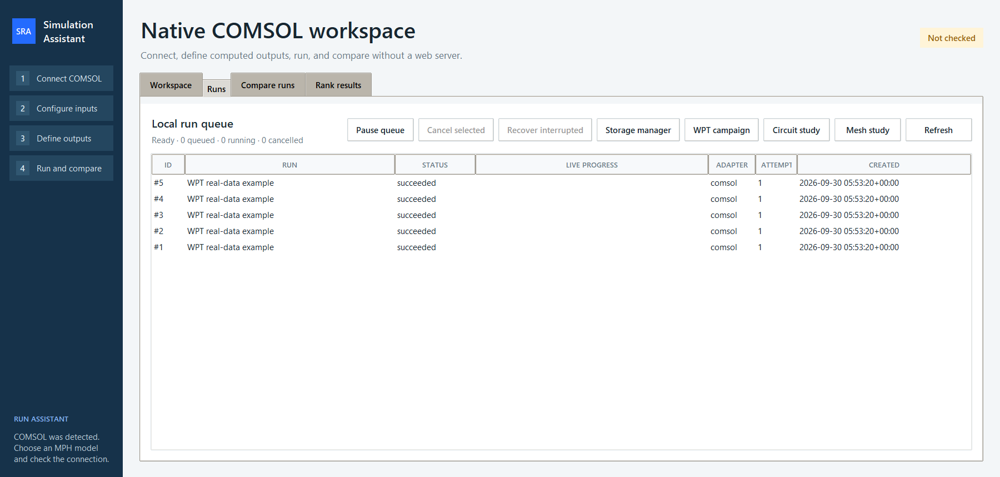
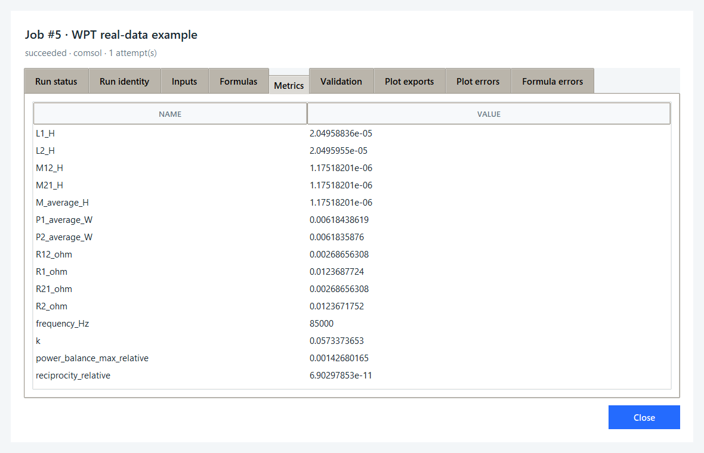
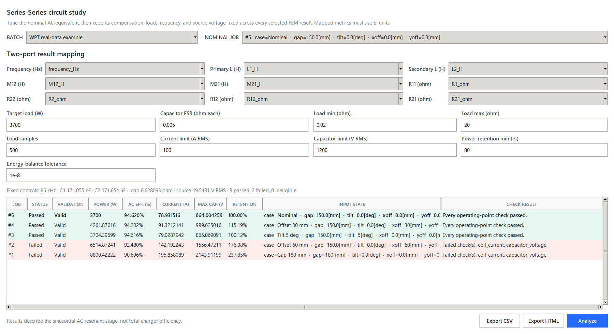

# Worked Example: 3D Wireless Power Transfer

This walkthrough uses five stored COMSOL simulation results from a 3D WPT
screening study. The screenshots show the native application replaying those
results on Windows. No new electromagnetic solve is performed during replay.

## Try the example

From the repository root, install the application and replay the dataset:

```powershell
python -m pip install -e .
python examples/replay_wpt_circuit.py --desktop
```

The example needs Python with Tkinter, but does not need a COMSOL installation,
license, MPH file, or network connection. It creates its own database under
`.sim-assistant/wpt-example/`. Existing workspace profiles and production results
are kept in their original locations. Repeating the command reuses the imported
jobs instead of duplicating them.

For a report without opening a desktop window:

```powershell
python examples/replay_wpt_circuit.py
```

Both commands write `circuit-study.csv` and `circuit-study.html` into the example
workspace. A [saved HTML report](examples/wpt-circuit-study.html) and
[CSV result table](examples/wpt-circuit-study.csv) are also included here. Download
the HTML file and open it locally to see the formatted report.

## 1. Inspect the stored runs



The **Runs** tab contains five completed simulations. The creation timestamps in
this example describe the import session, not the original COMSOL solve dates.
The connection badge reads **Not checked** because replay does not connect to a
solver. Open **Circuit study** to analyze the results.

## 2. Review the electromagnetic outputs



Double-click the nominal job and choose **Metrics**. The example includes the
complete complex two-port represented by self and mutual inductances plus all
four resistance entries. Values use SI units. The nominal coupling is about
`0.05734`, with self-inductances near `20.496 uH` at `85 kHz`.

The public dataset retains source qualification checks and a SHA-256 digest for
each original results file. The replay records that its validation state came
from these source checks; it does not claim to run fresh validation against an
MPH model.

## 3. Calculate operating points



Choose the nominal job, confirm the nine detected metric mappings, and select
**Analyze**. The example uses:

- target load power: `3700 W`;
- frequency: `85 kHz`;
- capacitor ESR: `0.005 ohm` per capacitor;
- logarithmic load search: `0.02` to `20 ohm`, with `500` samples;
- current limit: `100 A RMS`;
- capacitor-voltage limit: `1200 V RMS`;
- minimum load-power retention: `80%`.

The nominal compensation is approximately `171.055 nF` on each side. The selected
load is `0.628093 ohm` and the source is `49.5431 V RMS`. These controls remain
fixed when evaluating the other four scenarios.

| Scenario | Load power (W) | AC efficiency (%) | Max current (A RMS) | Max capacitor voltage (V RMS) | Electrical screening |
| --- | ---: | ---: | ---: | ---: | --- |
| Nominal, gap 150 mm | 3700.00 | 94.620 | 78.932 | 864.00 | Passed |
| Offset 30 mm | 4261.88 | 94.202 | 91.321 | 999.63 | Passed |
| Tilt 5 deg | 3704.40 | 94.616 | 79.029 | 865.07 | Passed |
| Offset 60 mm | 6514.87 | 92.480 | 142.192 | 1556.47 | Failed |
| Gap 180 mm | 8800.42 | 90.696 | 195.858 | 2143.91 | Failed |

The two failed cases illustrate why delivered power alone is insufficient:
fixed compensation and voltage can drive excessive current when coupling drops.
Both exceed the current and capacitor-voltage screening limits. Higher power
retention is not a safety guarantee.

## Source and interpretation

The source design is `d_61ae6417c6`, with inner radius `30.64633 mm`, outer radius
`103.958467 mm`, `10` turns, and ferrite radius `124.954166 mm`.
The shareable input data is
[`examples/wpt_circuit_results.json`](../examples/wpt_circuit_results.json).

These are simulation results, not laboratory measurements. The efficiency is
the modeled sinusoidal AC resonant-stage efficiency. Material loss assumptions,
prescribed temperature, winding resistance, and capacitor ESR affect the result.
This example does not establish total charger efficiency, component ratings,
thermal limits, or a hardware operating envelope. Electrical screening here does
not check ferrite flux density or saturation.

For the equations, required outputs, and model preparation, see
[WPT Circuit Study](WPT_CIRCUIT_STUDY.md).
